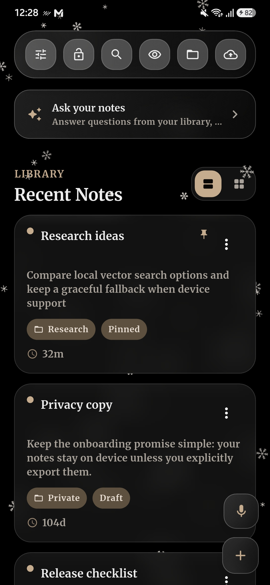
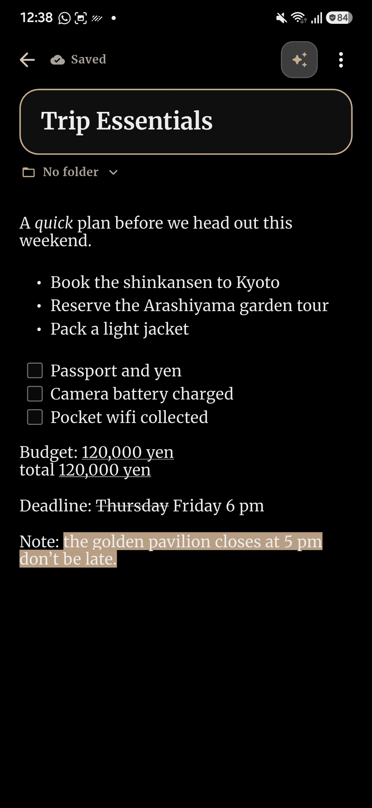
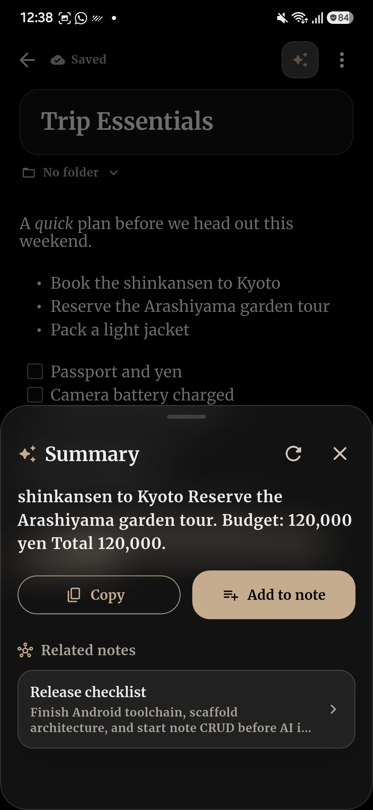
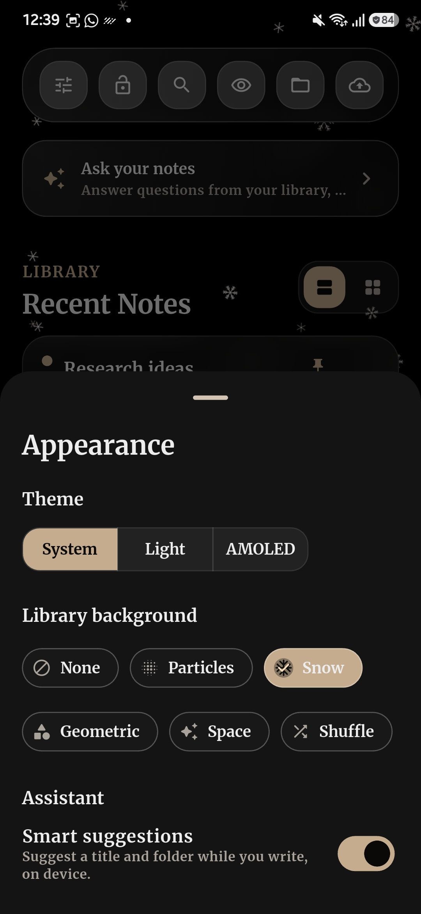
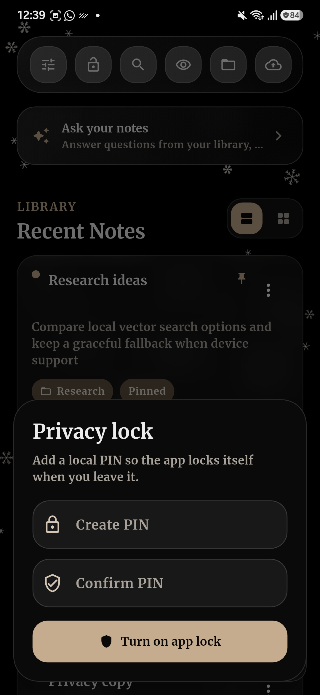

# Offline AI Notepad

A privacy-first, offline-first note-taking app built with Flutter. Notes live on your device, rich-text editing works without a network, and the AI features, semantic search and summarization, run as real models **on the device**, not as cloud calls.

## Screenshots

<p align="center">
  
  
  
  
  
</p>

## Highlights

- **On-device semantic search.** On Android, queries are embedded with a real `all-MiniLM-L6-v2` ONNX model and ranked by cosine similarity against per-note vectors in SQLite, so "car repair" can surface a note about "fixing the brakes." The text never leaves the device.
- **On-device summarization.** Note summaries run through an ONNX seq2seq model (`Falconsai/text_summarization`, a summary-tuned T5-small) locally, with no API key, no server, and support for airplane mode.
- **Ask your notes.** Ask a natural-language question and get an answer synthesized from your own notes, with tap-through citations — retrieval-augmented over the on-device embeddings, fully offline. Plus a "related notes" strip and smart title/folder/tag suggestions while you write.
- **Voice → note, on-device.** Dictate a note with the platform's built-in recognizer running in on-device mode, so captured audio never leaves the phone; the transcript becomes an editable, searchable note.
- **Rich capture.** Inline images, checklists, tags and folders, and lossless-enough Markdown import/export — the everyday note-taking table stakes, all local.
- **AMOLED + liquid-glass design.** A switchable System / Light / AMOLED theme, translucent frosted-glass cards and controls, and a pluggable animated backdrop (particles, snow, geometric, space, or shuffle) behind the library.
- **Privacy by default.** Notes are stored locally in SQLite, with an optional PIN lock and passphrase-encrypted backup/restore.
- **Graceful degradation.** The native ONNX path is Android-only today; elsewhere the app falls back to lexical search and an extractive summarizer, so features degrade in quality rather than break.
- **Quality guardrails.** A `SummaryQualityGate` rejects looping, off-topic, or hallucinated output, and a near-duplicate cleanup drops redundant/contradictory sentences before a summary is ever shown.

## Download & Try It (Android)

Grab the latest APK from the [**v1.3.1 release**](https://github.com/atikulmunna/offline-ai-notepad/releases/tag/v1.3.1):

| Device | APK | Size |
|---|---|---|
| **Most phones** (last ~8 years, 64-bit) | [arm64-v8a](https://github.com/atikulmunna/offline-ai-notepad/releases/download/v1.3.1/offline-ai-notepad-v1.3.1-arm64-v8a.apk) | ~53 MB |
| Not sure / "incompatible" error | [universal](https://github.com/atikulmunna/offline-ai-notepad/releases/download/v1.3.1/offline-ai-notepad-v1.3.1-universal.apk) — installs on any device | ~141 MB |
| Older 32-bit devices | [armeabi-v7a](https://github.com/atikulmunna/offline-ai-notepad/releases/download/v1.3.1/offline-ai-notepad-v1.3.1-armeabi-v7a.apk) | ~44 MB |

**Install:** download the APK, allow "install from unknown sources" if prompted, and open it. It is signed with the project's release key (`CN=NativeNote`), so updates install cleanly in place; Android may still warn about an unknown developer simply because it's side-loaded rather than installed from a store.

**Why it's only ~52 MB:** the on-device AI models (~114 MB, powering summaries and semantic search) are **not** bundled in the APK. The first time you use an AI feature, the app offers to download them once from the `models-v1` release; after that they run fully offline. Core note-taking works without them.

## Design & Experience

The interface is built around a true-black AMOLED aesthetic with a reusable liquid-glass surface layer.

- **Three themes.** `System`, `Light` (the original warm "paper" look), and `AMOLED` (true `#000000` for OLED battery savings and contrast). The choice is persisted and, in `System` mode, follows the OS light/dark setting.
- **Liquid glass.** Cards, the header, buttons, the FAB, and the editor surfaces are translucent frosted panels (`BackdropFilter` blur over theme-aware tokens), so the background subtly refracts through the UI. A single `GlassSurface` widget backs all of them.
- **Animated backgrounds.** An optional backdrop plays behind the library: **Particles**, **Snow** (drawn as real six-armed snowflakes), **Geometric**, **Space** (a twinkling starfield), or **Shuffle** (a random style each launch). It respects the OS *reduce-motion* setting, is isolated in a `RepaintBoundary`, and never plays behind the editor, so writing stays calm and black.
- **Accessible & configurable.** Everything is chosen from an in-app Appearance sheet; there is no separate settings screen to hunt through.

## On-Device AI

The local AI path is built on ONNX Runtime for Android and uses two quantized models:

- **Summarization:** `Falconsai/text_summarization` (a summary-tuned T5-small), exported to ONNX and INT8-quantized. Encoder + decoder seq2seq with greedy decode.
- **Embeddings (semantic search):** `sentence-transformers/all-MiniLM-L6-v2`, exported to ONNX and INT8-quantized. 384-dim, mean-pooled over the attention mask, then L2-normalized.

**Semantic search.** Note vectors are stored as packed `Float32List` BLOBs in the SQLite `embeddings` table (schema v3). Notes are embedded on save (with a startup backfill for existing notes). At query time the app embeds the query, loads note vectors, and ranks by cosine similarity (`lib/features/notes/data/vector_note_search.dart`). If the query or any note lacks a native embedding, it falls back to the lexical `SemanticNoteSearch`.

**Summarization guardrails.** The native summary passes through a `SummaryQualityGate` (`lib/features/ai/data/summary_quality_gate.dart`) that rejects looping, shouty, off-topic, or list-marker-heavy output. The decoder cleanup (`OnnxSessionManager.cleanupGeneratedSummary`) also drops a near-duplicate trailing sentence, one sharing most of its content words with the first, which greedy decode tends to emit as a redundant or contradictory restatement. If a candidate fails the gate, the app falls back to the extractive `LocalNoteSummarizer`.

**Runtime abstraction.** The app talks to an internal `AiRuntime` interface rather than a specific SDK, so the inference backend can change without reworking the feature layer. High-level flow: check the model manifest → validate/stage assets into a runtime directory → the Android bridge prepares ONNX sessions → summaries and embeddings are computed locally → weak or unavailable native output falls back to the local path.

**Honest caveats.** The real embeddings and native summarizer are **Android-only** today (no iOS bridge yet); model binaries are exported/staged locally rather than committed to Git; and the summarizer is a small quantized model by design, a privacy/offline tradeoff, not GPT-class quality.

## How It Works

**Data storage.** SQLite via `sqflite`. Each note stores a plain-text `body` (for search, previews, and AI), a `body_delta` rich-text document (for the editor), a `summary`, folder relationship, pin/archive/delete state, and timestamps.

**Editor.** A title field, a folder picker, and a `flutter_quill` rich-text body. Autosave persists changes locally after a short debounce.

**Rich text.** Bold, italic, underline, strikethrough, text color, highlight, checklists, inline images, and clear-formatting. Formatting is stored with the note and restored on reopen. Images are copied into a local `attachments/` folder and referenced from the delta by file name, so they never bloat the searchable text.

**Voice notes.** A mic button captures speech via the platform's on-device recognizer (`speech_to_text` with `onDevice: true`); the transcript is saved as a normal note and opened in the editor for review.

**Note management.** Create/edit, folders, tags, pin, archive, trash/restore/permanent-delete, keyword or semantic search, and Markdown import/export.

## Technology Stack

- Flutter · Dart · Riverpod
- SQLite via `sqflite`
- `flutter_quill` for rich-text editing
- ONNX Runtime for Android for local model inference
- `shared_preferences` for persisted appearance settings

## Getting Started

### Prerequisites

- Flutter `3.41.5` and Dart `3.11.3` (see [docs/DEVELOPMENT_SETUP.md](docs/DEVELOPMENT_SETUP.md))
- Android Studio / Android SDK for Android builds

### Install & run

```powershell
flutter pub get
flutter run            # Android device/emulator
flutter run -d windows # desktop (lexical search + extractive summary fallback)
flutter run -d chrome  # web (same fallbacks)
```

If a Windows build fails with a symlink warning, enable Developer Mode in Windows settings first. If Android tooling is partial, run `flutter doctor` and `flutter doctor --android-licenses`.

### Local AI model setup (maintainers only)

**End users don't need this.** The installed app downloads the models on first use. Large model binaries are intentionally kept out of Git and out of the APK; only the per-model `README.md` files are tracked, and the `.onnx`/tokenizer binaries are served from the `models-v1` GitHub release the app downloads at runtime.

To regenerate the ONNX assets from source (needs a Python env with `optimum`, `onnx`, `onnxruntime`):

```powershell
# Summarization model -> assets/models/falconsai-summarizer-en-v1/
.\scripts\export_falconsai.ps1

# Embedding model (semantic search) -> assets/models/embedding-minilm-l6-v2-en-v1/
.\scripts\export_minilm_l6_v2.ps1
```

Each script exports the Hugging Face model to ONNX, quantizes to dynamic int8, and stages `model.onnx` (+ the encoder for the summarizer) plus tokenizer/config files.

> The scripts invoke optimum as `python -m optimum.commands.optimum_cli`, not `optimum-cli.exe` (the `.exe` wrapper exits silently with code 1 on this toolchain). Do not pass `-ExecutionPolicy Bypass`.

See [docs/LOCAL_MODEL_SETUP.md](docs/LOCAL_MODEL_SETUP.md) for detail.

## Reproduce Locally (End to End)

```powershell
flutter pub get
flutter analyze
flutter test
```

The unit tests cover the pieces that are easy to get wrong without a device: summary rejection (`test/summary_quality_gate_test.dart`), cosine ranking (`test/vector_note_search_test.dart`), the Float32 BLOB round-trip (`test/embedding_codec_test.dart`), lexical fallback (`test/semantic_search_test.dart`), and appearance persistence (`test/appearance_test.dart`).

To verify the AI features on a device:

1. **Build & install:** `flutter build apk --debug && adb install -r build/app/outputs/flutter-apk/app-debug.apk` (or `flutter run`).
2. **Summarization:** open a multi-paragraph note, open the AI panel, tap the refresh icon. Expect a short, on-topic summary of at most two sentences, or a clean extractive fallback if native output is weak.
3. **Semantic search:** seed ~20 notes, switch to semantic mode, and query by *meaning* rather than exact words. Vector ranking should beat the old lexical ranking; on Windows/web the same query still returns sensible lexical results.
4. **Persistence/migration:** launch on an existing v2 database and confirm it upgrades to v3 (adds `embedding` + `dim` columns) without data loss, and that a note's embedding row transitions `queued → indexed` with a non-null vector BLOB.

## Project Structure

```text
lib/
  app/                      App shell and theme system
  core/                     Shared infrastructure (database setup, etc.)
  features/
    appearance/             Theme mode + animated backgrounds + glass surfaces
    ai/                     AI runtime, model manifest, staging, summary flow
    notes/                  Notes domain, repositories, views, editor, actions
    security/               App lock and encrypted backup

android/
  app/src/main/kotlin/      Android ONNX bridge and native runtime code

assets/
  models/                   Manifest and locally staged model asset slots

docs/                       Development, model, and architecture notes
```

## Known Limitations

- Native ONNX summary quality is still being tuned (a small quantized model by design).
- The native AI path (real embeddings + summarizer) is **Android-only**; iOS has no bridge yet and falls back to lexical search + extractive summaries.
- Model binaries are exported/staged locally, so a fresh clone needs the export step before the native path works.
- The note list isn't virtualized, so on low-end devices the blurred glass cards over an animated background may cost frames; switch the background to *None* if needed.
- Android emulators can be unstable for heavier local model work.

## Documentation

- [docs/DEVELOPMENT_SETUP.md](docs/DEVELOPMENT_SETUP.md)
- [docs/LOCAL_MODEL_SETUP.md](docs/LOCAL_MODEL_SETUP.md)
- [docs/ARCHITECTURE_NOTES.md](docs/ARCHITECTURE_NOTES.md)
- [docs/IMPLEMENTATION_BACKLOG.md](docs/IMPLEMENTATION_BACKLOG.md)

## Repository Notes

- Local planning artifacts (e.g. the SRS) are intentionally not tracked in Git.
- Large local model files are intentionally excluded from standard Git history and served from a GitHub release at runtime.

## License

Licensed under the **GNU General Public License v3.0** — see [LICENSE](LICENSE). You may use, study, share, and modify it; distributed or forked versions must remain open-source under the same license.
